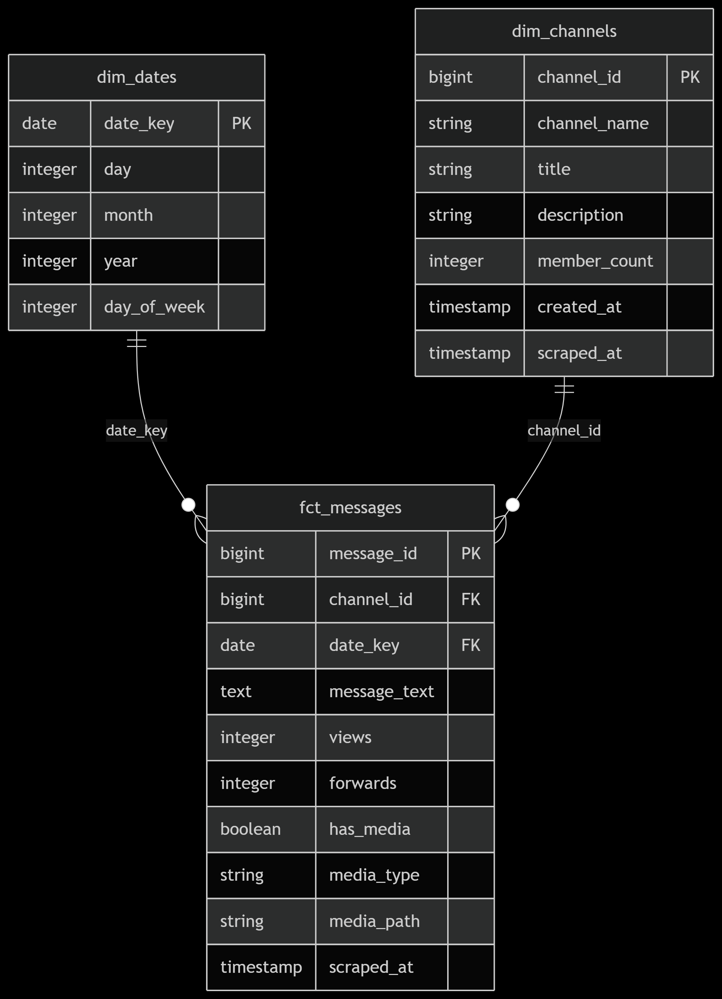

# Ethiopian Medical Data Warehouse - Star Schema

## Overview
Our dimensional model follows the Kimball methodology with the following components:

## Fact Tables

### `fct_messages`
- Records every Telegram message with metrics
- **Measures**: 
  - `views`: Number of message views
  - `forwards`: Number of times message was forwarded
  - `replies`: Number of replies to message
  - `message_length`: Character count of message text
- **Dimensions**:
  - `channel_key`: Link to dim_channels
  - `date_key`: Link to dim_dates
- **Grain**: One row per Telegram message

### `fct_image_detections`
- Records object detection results for images
- **Measures**:
  - `confidence`: Detection confidence score
  - `bbox`: Bounding box coordinates
- **Dimensions**:
  - `message_id`: Link to fct_messages
- **Grain**: One row per detected object in an image

## Dimension Tables

### `dim_channels`
- Attributes of Telegram channels
- **Attributes**:
  - `channel_name`: Unique name of channel
  - `total_messages`: Count of messages in channel
  - `first_message_date`: Date of first message
  - `last_message_date`: Date of most recent message

### `dim_dates`
- Calendar dates for analysis
- **Attributes**:
  - `date`: Date in YYYY-MM-DD format
  - `day`: Day of month (1-31)
  - `month`: Month number (1-12)
  - `year`: Year
  - `quarter`: Quarter (1-4)
  - `day_of_week`: Day of week (1=Monday, 7=Sunday)
  - `day_of_year`: Day of year (1-366)